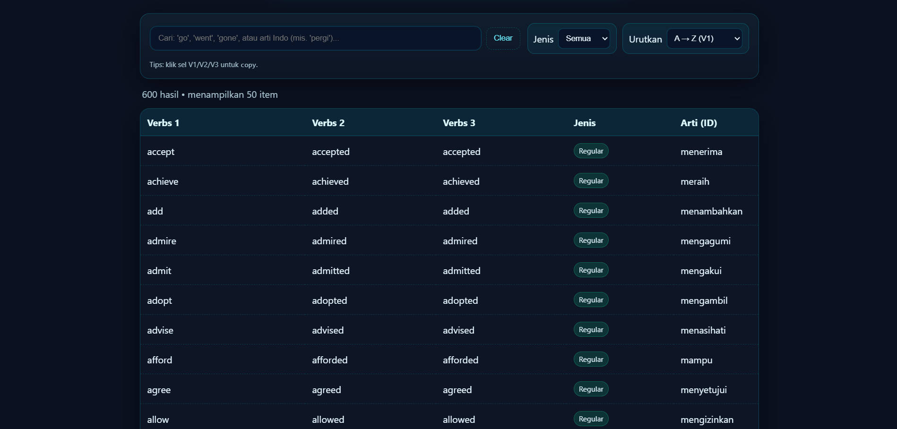

# ✨ Verb 1-2-3 Finder

**Verb 1-2-3 Finder** is an open-source project by **Aether Studio** to help learn **English verbs (V1, V2, V3)** - complete with Indonesian meanings, instant search, Regular/Irregular filters, usage tips, and interactive quizzes.  
Everything runs **client-side** (HTML, CSS, vanilla JS) with no server or login required.  



---

## 🚀 Key Features

- 🔍 **Instant Search**  
  Search verbs (V1/V2/V3) or Indonesian meaning. Results appear in real-time.

- 🌀 **Filter & Sort**  
  Separate Regular & Irregular verbs, sort A→Z / Z→A.

- 🎨 **Consistent UI**  
  Neon-dark minimalist theme, focus on readability & responsiveness.

- 📂 **Open Data**  
  All verbs stored in JSON for easy updates.

---

## 📝 Learning Aids
- 📘 Difference between **Regular vs Irregular** verbs with examples.  
- 📊 Comparison tables.  
- 💡 Quick tips: vowel patterns (sing - sang - sung), same forms, verb families, etc.  
- 🎥 **Tutorial videos** in a carousel with progress bar animation.

---

## 🧩 Interactive Quiz
Practice verb forms with 2 modes:

1. **Verb Forms**  
   - V1 → guess V2 & V3  
   - V2 → guess V1 & V3  
   - V3 → guess V1 & V2  
   - Random

2. **Sentence (Fill-in-the-Blank)**  
   Questions in sentences, e.g.:  
   *They have …. the homework* → answer with V3 form.

### ✨ Quiz Features
- Auto-reveal answers after **2 wrong attempts**  
- **Anti-duplicate answers**: repeated wrong input not counted  
- Timer per question + animated progress bar  
- Final score + Grade (A–E)  
- Leaderboard (localStorage)  
- Confetti 🎉 when scoring ≥80%  
- Remedial: retry incorrect questions  
- Randomized deck with **no-repeat mechanism** (minimizes repetition)  

---

## 🛠️ Technology
- HTML, CSS, vanilla JavaScript  
- LocalStorage (deck & leaderboard)  
- JSON data (`data/verbs.json`, `data/quizk.json`)  
- Font Awesome Icons  
- YouTube iframe (tutorial carousel)  

---

## 📥 How to Run
1. Clone repo:
   ```bash
   git clone https://github.com/rillToMe/VerbsEnglishID.git
   cd VerbsEnglishID
   ```
2. Open `index.html` in your browser.  
   (No server needed, fully client-side.)  
3. To edit quiz data, modify:  
   - `data/verbs.json` → verb list  
   - `data/quizk.json` → sentence-based questions  

---

## 🌌 About
Created by **Aether Studio**  
Indie developer passionate about making fast-learning tools with neon-dark aesthetics.  

🔗 [Website](https://aether-studio.vercel.app) · [GitHub](https://github.com/rillToMe) · [Instagram](https://instagram.com/rill_lyrics)

---

## 📜 License
MIT License © 2025 Aether Studio
